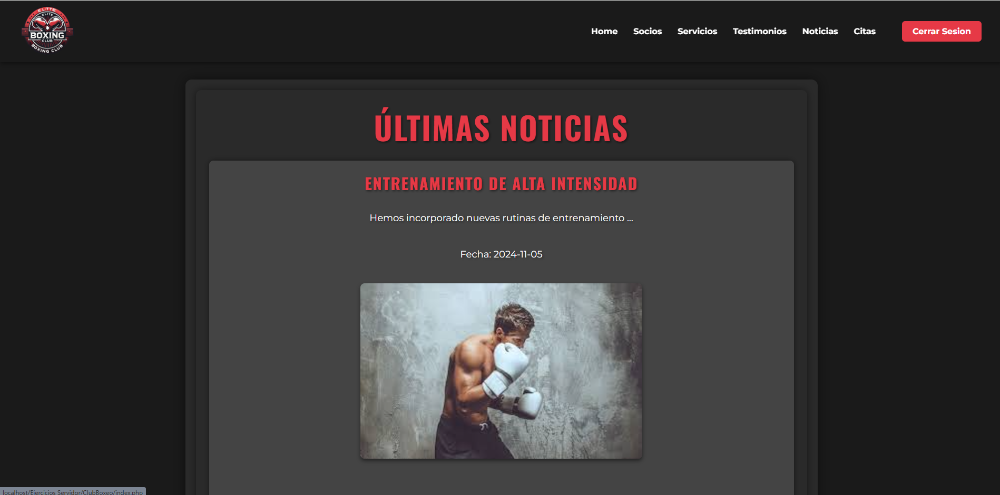
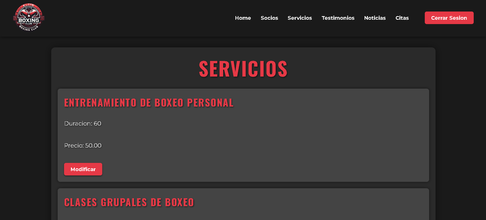

<p align="center">
  
</p>

# Gym Management System

Este proyecto es una aplicación PHP diseñada para gestionar las operaciones de un gimnasio, permitiendo la gestión de usuarios con roles de administrador y usuario estándar.

## Características

- **Registro y Autenticación de Usuarios**: Los usuarios pueden registrarse y autenticarse con roles de administrador y usuario.
- **Roles de Usuario**:
  - **Admin**: Tiene acceso a la gestión de socios y la configuración de citas.
  - **User**: Puede acceder a los servicios y reservar citas.
- **Gestión de Socios**: Los administradores pueden gestionar y visualizar los detalles de los socios.
- **Gestión de Citas**: Los usuarios pueden programar y administrar citas.
- **Gestión de Productos y Servicios**: Administración de productos disponibles en el gimnasio.
- **Noticias y Testimonios**: Sección para mostrar las últimas noticias y testimonios de clientes.

## Demo

Puedes ver una demo en vivo de la aplicación aquí: [Gym Management System Demo](https://gsanchezcalvente.000.pe/)

**Credenciales de la demo**:
- **Usuario Socio**: 
  - **Usuario**: `carlos`
  - **Contraseña**: `user`
- **Administrador**: 
  - **Usuario**: `admin`
  - **Contraseña**: `admin`

## Estructura del Proyecto

```
Directory structure:
└── gsoftware-gs-clubboxeo/
    ├── README.md
    ├── ajustes.php
    ├── api.php
    ├── citas.php
    ├── index.php
    ├── login.php
    ├── logout.php
    ├── noAccess.php
    ├── noticias.php
    ├── noticiasMundiales.php
    ├── productos.php
    ├── servicios.php
    ├── socios.php
    ├── testimonios.php
    ├── img/
    │   ├── assets/
    │   ├── noticias/
    │   ├── productos/
    │   └── usuarios/
    ├── src/
    │   ├── forms/
    │   │   ├── formualrioModificarProducto.php
    │   │   ├── formularioAgregarProducto.php
    │   │   ├── formularioBuscarCita.php
    │   │   ├── formularioBuscarServicio.php
    │   │   ├── formularioBuscarSocio.php
    │   │   ├── formularioCita.php
    │   │   ├── formularioContacto.php
    │   │   ├── formularioModificarCita.php
    │   │   ├── formularioModificarServicio.php
    │   │   ├── formularioModificarSocio.php
    │   │   ├── formularioNoticia.php
    │   │   ├── formularioServicio.php
    │   │   ├── formularioSocio.php
    │   │   └── formularioTestimonio.php
    │   ├── html/
    │   │   ├── footer.html
    │   │   └── menu.php
    │   ├── includes/
    │   │   ├── auth.php
    │   │   └── logout.php
    │   ├── js/
    │   │   ├── carrito.js
    │   │   ├── validarBuscarCita.js
    │   │   ├── validarBuscarServicio.js
    │   │   ├── validarBuscarSocio.js
    │   │   ├── validarCita.js
    │   │   ├── validarModificarCita.js
    │   │   ├── validarModificarSocio.js
    │   │   ├── validarNoticia.js
    │   │   ├── validarServicio.js
    │   │   ├── validarSocio.js
    │   │   └── validarTestimonio.js
    │   ├── php/
    │   │   ├── agregarCita.php
    │   │   ├── agregarNoticia.php
    │   │   ├── agregarProducto.php
    │   │   ├── agregarServicio.php
    │   │   ├── agregarSocio.php
    │   │   ├── agregarTestimonio.php
    │   │   ├── buscarCita.php
    │   │   ├── buscarServicio.php
    │   │   ├── buscarSocio.php
    │   │   ├── calendario.php
    │   │   ├── conexion.php
    │   │   ├── eliminarCita.php
    │   │   ├── eliminarProducto.php
    │   │   ├── eliminarSocio.php
    │   │   ├── modificarCita.php
    │   │   ├── modificarProducto.php
    │   │   ├── modificarServicio.php
    │   │   ├── modificarSocio.php
    │   │   ├── mostrarCita.php
    │   │   ├── mostrarInformacionPersonal.php
    │   │   ├── mostrarNoticia.php
    │   │   ├── mostrarNoticias.php
    │   │   ├── mostrarProductos.php
    │   │   ├── mostrarServicios.php
    │   │   ├── mostrarSocios.php
    │   │   ├── mostrarTestimonios.php
    │   │   └── ultimasNoticias.php
    │   └── sql/
    │       ├── BD.sql
    │       └── club.sql
    └── styles/
        ├── calendario.css
        ├── footer.css
        ├── formulario.css
        ├── menu.css
        ├── productos.css
        └── style.css

```

## Instalación y Configuración

1. **Requisitos**:
   - Servidor web (Apache o similar).
   - PHP 7.4 o superior.
   - Base de datos MySQL.

2. **Configuración**:
   - Clona este repositorio en tu servidor local o de producción.
   - Configura la conexión a la base de datos en `src/php/conexion.php`.
   - Importa el esquema de la base de datos desde `src/sql/club.sql`.

3. **Iniciar la Aplicación**:
   - Asegúrate de que tu servidor web esté ejecutándose.
   - Accede a `http://localhost/tu-proyecto` en tu navegador.

## Uso

- **Navegación**: El menú de navegación incluye enlaces a las secciones principales como Home, Servicios, Testimonios, Noticias y Citas.
- **Acceso de Administrador**: Si el usuario es un administrador, tendrá acceso a funcionalidades adicionales, como la gestión de socios y productos.
- **Cerrar Sesión**: Los usuarios pueden cerrar sesión de manera segura usando el enlace de cierre de sesión.

## Capturas de Pantalla

<p align="center">
  
</p>

<p align="center">
  
</p>

## Créditos

- Desarrollado por: _Gonzalo Sánchez Calvente_

## Licencia

Este proyecto está licenciado bajo la [MIT License](LICENSE).


# Documentación de la API de Productos

## Introducción
Esta API permite gestionar productos en una base de datos. Soporta operaciones de lectura, creación, actualización y eliminación de productos mediante los métodos HTTP `GET`, `POST`, `PUT` y `DELETE`.

## Configuración
- **Formato de respuesta**: JSON
- **CORS**: Permite solicitudes desde cualquier origen (`*`).
- **Autenticación**: Se requiere una API Key válida en la URL.

## Endpoints

### Autenticación
Todas las solicitudes deben incluir una API Key en la URL, por ejemplo:
```
GET /api.php/t7q7er9ye1F9OT2tKAcb38yewWoluINX
```
Si la API Key es inválida o no se proporciona, se retorna un error:
```json
{
    "status": "error",
    "message": "API Key inválida o no proporcionada"
}
```

---
### Obtener productos
#### `GET /api.php/{apiKey}`
Obtiene todos los productos.

#### `GET /api.php/{apiKey}?nombre={nombre}`
Filtra productos cuyo nombre contenga `{nombre}`.

#### `GET /api.php/{apiKey}?precio={precio}`
Filtra productos cuyo precio sea menor a `{precio}`.

#### `GET /api.php/{apiKey}?id={id}`
Obtiene un producto específico por su ID.

**Ejemplo de respuesta:**
```json
{
    "status": "success",
    "data": [
        {
            "id": 1,
            "nombre": "Café",
            "precio": 3.50,
            "imagen": "cafe.jpg"
        }
    ]
}
```

---
### Crear un producto
#### `POST /api.php/{apiKey}`
Crea un nuevo producto.

**Cuerpo de la solicitud (JSON):**
```json
{
    "nombre": "Té Verde",
    "precio": 2.50,
    "imagen": "te_verde.jpg"
}
```

**Respuesta:**
```json
{
    "status": "success",
    "message": "Producto creado exitosamente",
    "id": 2
}
```

---
### Actualizar un producto
#### `PUT /api.php/{apiKey}`
Actualiza un producto existente.

**Cuerpo de la solicitud (JSON):**
```json
{
    "id": 1,
    "nombre": "Café Premium",
    "precio": 4.00
}
```

**Respuesta:**
```json
{
    "status": "success",
    "message": "Producto actualizado correctamente"
}
```

---
### Eliminar un producto
#### `DELETE /api.php/{apiKey}`
Elimina un producto por su ID.

**Cuerpo de la solicitud (JSON):**
```json
{
    "id": 1
}
```

**Respuesta:**
```json
{
    "status": "success",
    "message": "Producto eliminado correctamente"
}
```

---
### Errores comunes
Si un producto no se encuentra:
```json
{
    "status": "error",
    "message": "No se encontraron productos con ese ID"
}
```
Si faltan datos requeridos:
```json
{
    "status": "error",
    "message": "Faltan datos necesarios (nombre, precio, imagen)"
}
```

